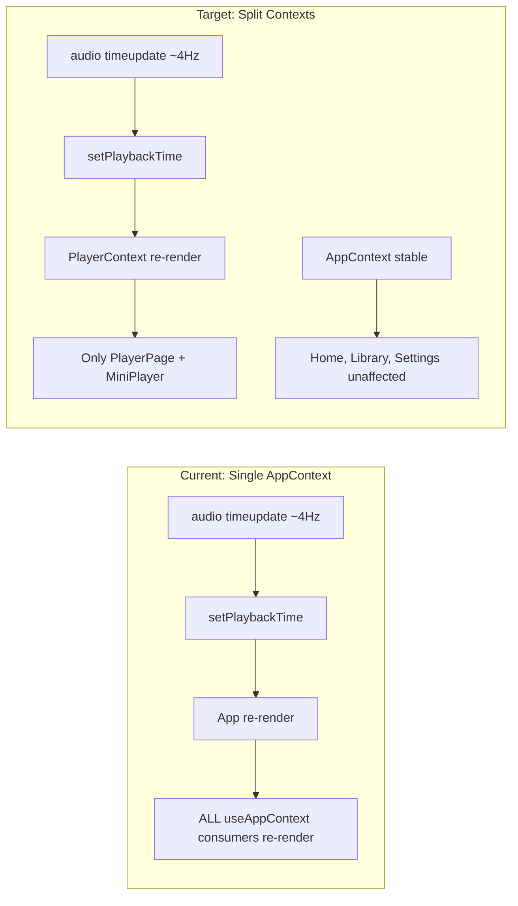

# PWA Optimization Roadmap

Inspired by patterns from the [official Audiobookshelf app](https://github.com/advplyr/audiobookshelf-app). All work targets [apps/pwa/src/App.tsx](apps/pwa/src/App.tsx) and new files extracted from it.

---

## Phase 1 — Fix Playback and Re-render Bugs

The root problem: `App.tsx` is 1318 lines with a single `AppContext` whose provider value is recreated on every render. `setPlaybackTime` fires ~4x/sec during playback, causing every `useAppContext()` consumer to re-render — including pages that don't need playback time.

- **1a. Split context into `AppContext` + `PlayerContext`**
  - `AppContext`: session, client, server config, libraries, offline list, `startBook`, `downloadBook` — changes rarely
  - `PlayerContext`: `activePlayback`, `playbackTime`, `isPlaying`, `playbackRate`, `seekTo`, `seekBy`, `jumpToTrack`, `togglePlayback`, `currentTrackDuration` — changes frequently but only consumed by player UI
  - Memoize both provider values with `useMemo`
  - New files: `src/contexts/AppContext.tsx`, `src/contexts/PlayerContext.tsx`

- **1b. Throttle `playbackTime` updates**
  - Replace raw `timeupdate` listener with a 1s `setInterval` poll (matches official app pattern) or `requestAnimationFrame` gated to 1 update/sec
  - Only the progress bar and time display need sub-second precision

- **1c. Debounce `commitProgress`**
  - While playing: trailing debounce (5s)
  - On pause/seek: immediate flush
  - On `visibilitychange` (hidden) / `pagehide`: immediate flush
  - Prevents unnecessary API calls and state churn

---

## Phase 2 — Code Splitting and Bundle Size

Current bundle loads epubjs, all pages, and all logic upfront for every user.

- **2a. Route-based code splitting with `React.lazy`**
  - Lazy-load: `ReaderPage`, `PlayerPage`, `DownloadsPage`, `SettingsPage`
  - Keep `HomePage`, `LoginPage`, `SetupPage` in main bundle (critical path)
  - Wrap lazy routes in `<Suspense>` with a lightweight loading skeleton

- **2b. Extract page components into separate files**
  - `src/pages/HomePage.tsx`, `src/pages/LibraryPage.tsx`, `src/pages/BookPage.tsx`, `src/pages/ReaderPage.tsx`, `src/pages/PlayerPage.tsx`, `src/pages/DownloadsPage.tsx`, `src/pages/SettingsPage.tsx`
  - `src/components/Shell.tsx`, `src/components/BottomNav.tsx`, `src/components/MiniPlayer.tsx`, `src/components/BookCard.tsx`, `src/components/QueryState.tsx`

- **2c. Extract hooks**
  - `src/hooks/usePlayback.ts` — audio ref, play/pause/seek, event listeners, progress commit
  - `src/hooks/useLibraries.ts` — existing library queries
  - `src/hooks/useOffline.ts` — download/remove/list offline books

---

## Phase 3 — Library Browsing Performance

Current: all library items fetched and rendered at once. Official app uses paginated API + scroll-based DOM management.

- **3a. Paginate library API calls**
  - Use ABS `limit` + `page` params on `/api/libraries/:id/items`
  - Implement infinite scroll with `useInfiniteQuery` from TanStack Query

- **3b. Virtualize the book grid**
  - Add `@tanstack/react-virtual` for the library grid
  - Only render visible cards + small overscan buffer

- **3c. Optimize cover images**
  - Add `loading="lazy"` to all cover `` elements
  - Add `?ts={updatedAt}` cache-bust param (matches official app pattern)
  - Fade-in on load with CSS `opacity` transition
  - `React.memo` on `BookCard` to prevent re-renders from parent context changes

- **3d. Tune React Query caching**
  - Libraries list: `staleTime: 5 * 60 * 1000` (5 min, matches official app)
  - Personalized shelves: `staleTime: 2 * 60 * 1000`
  - Item detail: `staleTime: 60 * 1000`
  - Set `retry: 2` globally for mobile network resilience

---

## Phase 4 — Network Resilience

Current: no retry, no reconnection, no background resume. Official app has 401 refresh queues, socket reconnection, and visibility-based progress refresh.

- **4a. Background resume handler**
  - On `visibilitychange` (visible after > 30s hidden): re-fetch current item progress from server
  - If server progress is ahead of local, offer to jump or auto-sync (last-write-wins by `updatedAt`)
  - Flush any pending local progress on hide

- **4b. Offline progress queue**
  - When `commitProgress` fails (network error), queue the payload in localStorage
  - Drain queue on next successful API call or `online` event
  - Show subtle sync status indicator (matches official app's sync badge)

- **4c. API client retry**
  - Add exponential backoff retry (2 attempts) to `AudiobookshelfClient` fetch calls
  - Handle 401 with session invalidation and redirect to login

---

## Phase 5 — Player Features

Inspired by official app capabilities missing from our PWA.

- **5a. Sleep timer**
  - Options: 5/10/15/30/60 min, end of chapter
  - `setTimeout` that calls `audio.pause()`
  - "End of chapter" mode: check remaining chapter time on each `timeupdate`, pause when chapter ends
  - Persist last-used timer duration in localStorage

- **5b. Bookmarks**
  - Use ABS bookmark API (`POST /api/me/item/:id/bookmark`)
  - Show bookmark list in player with tap-to-seek
  - "Add bookmark" button captures current time + optional title

- **5c. MediaSession API integration**
  - Set `navigator.mediaSession.metadata` (title, artist, artwork)
  - Handle `play`, `pause`, `seekbackward`, `seekforward`, `previoustrack`, `nexttrack` actions
  - Enables lock screen / notification controls on mobile browsers

- **5d. Playback rate persistence**
  - Already stored in localStorage; ensure it's restored on app reload and new book start
  - Sync with server user settings if ABS API supports it

---

## Phase 6 — Polish

- **6a. Offline ebook support**
  - Fetch EPUB blob and store in IndexedDB alongside audio downloads
  - Load from blob URL in reader when offline

- **6b. Download improvements**
  - Parallel track downloads (2-3 concurrent)
  - Show per-track progress with byte counts
  - Handle storage quota errors gracefully

- **6c. PWA service worker caching**
  - Add Workbox runtime caching strategies in `vite.config.ts`:
    - Cover images: `CacheFirst` with 7-day expiry
    - API metadata: `StaleWhileRevalidate` with 5-min expiry
    - Audio streams: `NetworkOnly` (too large to cache generically)

---

## Dependency Summary

No new major dependencies required for Phases 1-2. Phase 3 adds `@tanstack/react-virtual`. Phases 4-6 use browser APIs and existing libraries.
