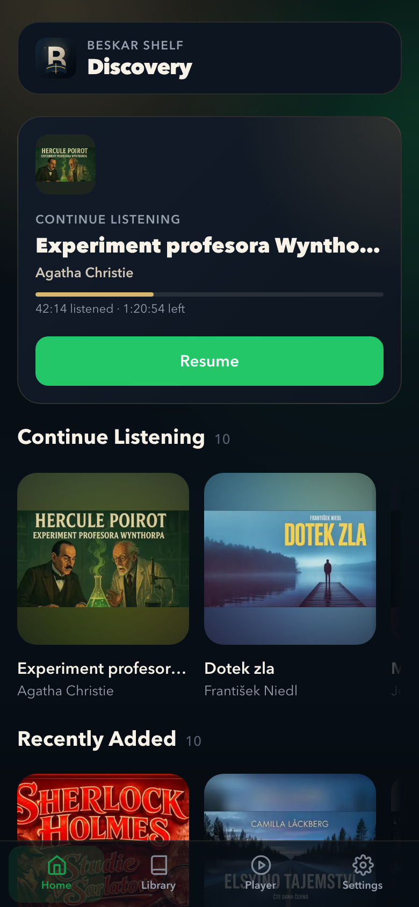
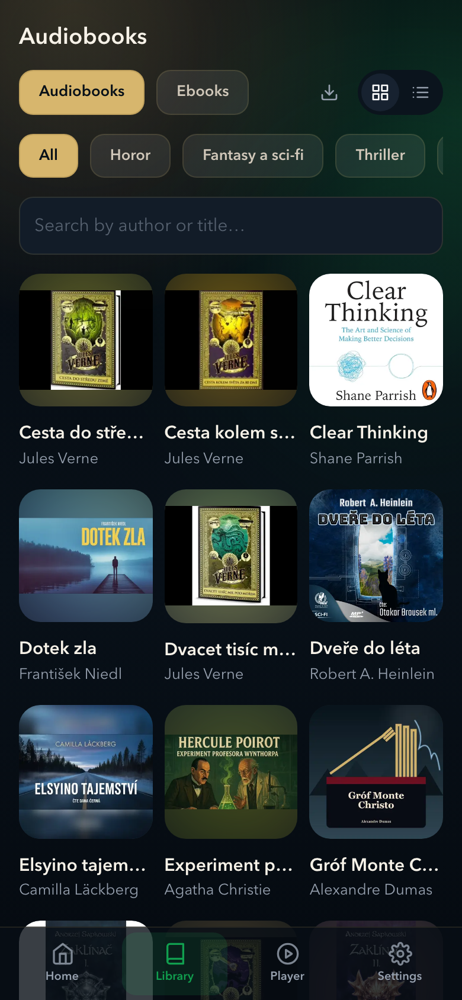
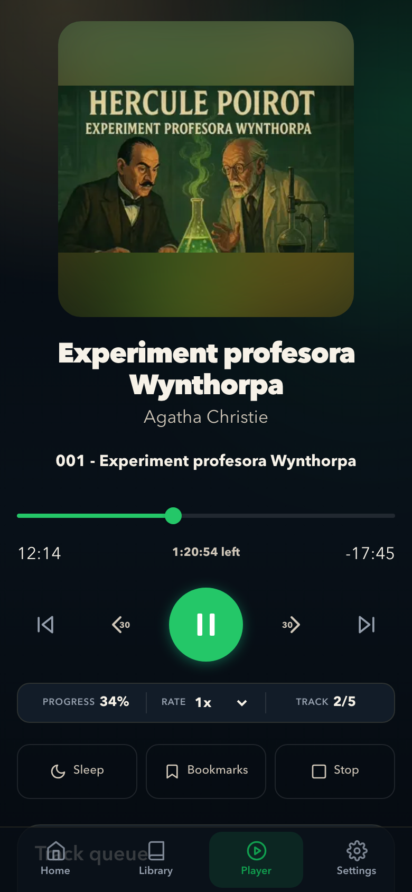
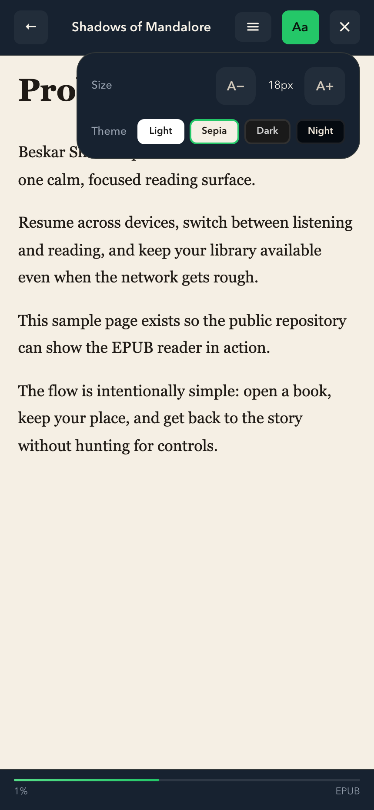

# beskar-shelf

A PWA forged from pure beskar for your [Audiobookshelf](https://github.com/advplyr/audiobookshelf) armory. Focused on **YouTube → mp3 processing** and audiobook library management — download, organise, play, read, sync progress, stash offline. This is the Way.

> **Live demo:** [beskar-shelf.onrender.com](https://beskar-shelf.onrender.com)
> The demo runs on Render's free tier, so the first visit after a period of inactivity may take ~1 minute while the service wakes up.

## Screenshots

<table>
  <tr>
    <td></td>
    <td></td>
    <td></td>
    <td></td>
  </tr>
  <tr>
    <td align="center">Home</td>
    <td align="center">Library</td>
    <td align="center">Player</td>
    <td align="center">Reader</td>
  </tr>
</table>

## The Armory

- **YouTube → MP3 pipeline** — download playlists, tag, organise into Audiobookshelf-ready folders
- Library browsing with home shelves
- Chapter list, resume state, item detail
- Player with rate control, seek, queue, progress sync
- EPUB/PDF reader via shared `shelf-pdf-reader` component
- Offline downloads stored in IndexedDB
- Library metadata management (titles, authors, collections, series)

## Layout

```text
beskar-shelf/
├── src/                     # React + TypeScript source
├── public/                  # Icons, favicon
├── index.html
├── package.json
├── vite.config.ts           # Vite + PWA + proxy
├── Dockerfile               # Multi-stage build → nginx
├── nginx.conf               # PWA container nginx template
├── tools/                   # beskar-tools Python package (grab, organize, …)
├── tools/grab/              # `grab` binary shim + per-project env + links
├── Makefile
└── .env.example
```

## Quick Start

```bash
make install
make dev
```

## Configuration

Copy `.env.example` to `.env`:

| Variable | Purpose |
|---|---|
| `VITE_APP_NAME` | Display name |
| `VITE_DEFAULT_SERVER_URL` | Pre-filled server URL on first launch |
| `VITE_ABS_PROXY_BASE` | Dev proxy prefix (default `/abs`) |
| `VITE_DEMO_USERNAME` | Optional pre-filled login username — public demo only, never real creds |
| `VITE_DEMO_PASSWORD` | Optional pre-filled login password — public demo only, never real creds |
| `ABS_URL` | Optional Audiobookshelf base URL for local tooling and dev proxy |
| `ABS_TOKEN` | Optional API token for metadata management |
| `ABS_LIBRARY_ID` | Optional target library for metadata management |
| `IMAGE_NAME` | Docker image tag for app deployment |
| `CONTAINER_NAME` | Container name used by Docker Compose |
| `APP_PORT` | Host port exposed by the app container |
| `ABS_UPSTREAM` | Audiobookshelf base URL the app container proxies to |

### Get an API token

If you want to use repo tooling that expects `ABS_TOKEN`, you can obtain one
without opening the Audiobookshelf UI token screen:

```bash
make abs-token
```

The helper prompts for your Audiobookshelf URL, username, and password, then
prints the token so you can paste it into `.env`.

### Fill missing descriptions

Export books with empty Audiobookshelf descriptions into a JSON file you can
fill in and apply later:

```bash
make abs-descriptions
./tools/fill-abs-descriptions --apply descriptions.todo.json
```

The tool reads `ABS_URL` or `ABS_LOCAL_URL`, `ABS_TOKEN`, and `ABS_LIBRARY_ID`
from `.env`.

## Development

```bash
make install    # dependencies
make dev        # Vite dev server + ABS proxy
make lint       # linter
make test       # tests
make build      # production bundle
```

`make dev` proxies browser requests to `ABS_URL` under `/abs`, sidestepping CORS when your Audiobookshelf server sits on a different origin.

## Deploy

This repo now owns the Beskar Shelf app only. Manage the Audiobookshelf
server itself in your infrastructure repo, then point the app at it
through `ABS_UPSTREAM`.

### Render (free tier)

The included `render.yaml` deploys a Node.js Web Service that serves the
built PWA and proxies `/abs/*` to your Audiobookshelf server — no CORS
configuration needed.

1. Fork this repo and connect it to [Render](https://render.com).
2. Create a **New Web Service** and select the repo (or use the Blueprint from `render.yaml`).
3. Set these environment variables on the Render dashboard:
   - `ABS_UPSTREAM` — your Audiobookshelf URL (e.g. `https://books.example.com`)
   - `VITE_DEFAULT_SERVER_URL` — same URL (pre-fills the login form)
4. Deploy. Render builds the Vite bundle and starts `server.js`.

Free-tier services spin down after 15 minutes of inactivity. The first
request after idle takes ~1 minute while the service restarts.

### Docker

```bash
cp .env.example .env
$EDITOR .env
docker compose up -d --build
```

The container serves the PWA on `http://localhost:4173` and proxies `/abs/*`
to `ABS_UPSTREAM`, so the app can stay same-origin without bundling the
Audiobookshelf server into this repo.

If you prefer Make targets, `make deploy`, `make deploy-down`, and `make deploy-logs`
now wrap the same Compose commands.

## Grab: YouTube → MP3

Python pipeline under `tools/beskar_tools/` (exposed as `beskar-grab` and the
`tools/grab/grab` shim). Details in `tools/README.md`.

```bash
make install-tools    # create tools/.venv + install beskar-tools
make doctor           # preflight checks
make download-dry-run # validate + print plan
make download         # forge the audiobooks
```

## Ebook Utilities

`tools/fix-ebooks` moves flat ebook files into per-book subdirectories so Audiobookshelf can scan them. Every PDF it moves is also linearised in place via `qpdf` so the in-app reader can stream the first page without downloading the whole file:

```bash
./tools/fix-ebooks /path/to/author-directory                  # move + linearise PDFs
./tools/fix-ebooks /path/to/author-directory --no-linearise   # move only
```

If `qpdf` isn't installed (`brew install qpdf` / `apt install qpdf`), `fix-ebooks` warns once and falls back to plain moves.

## Library Management

The `abs-library-manager` skill fixes titles, authors, collections, and series metadata through the Audiobookshelf API after a library scan.
